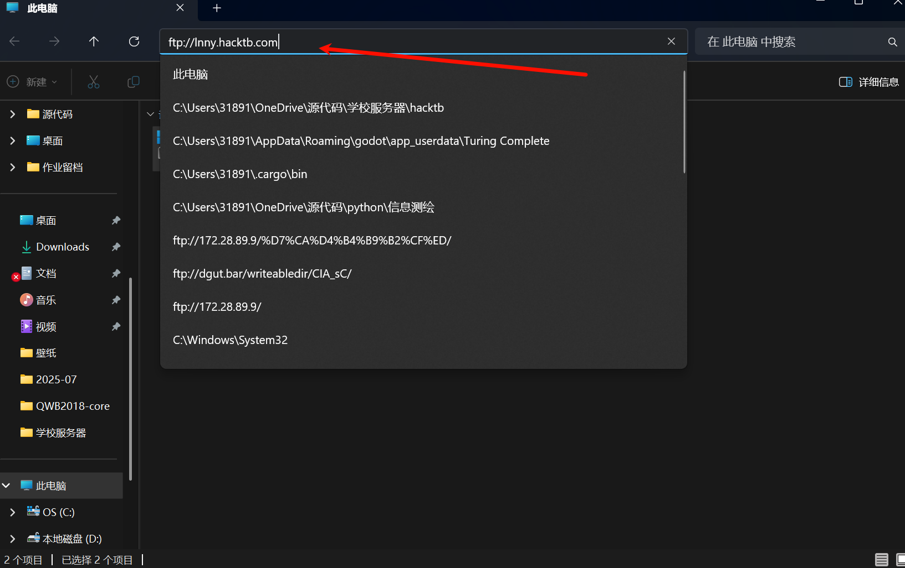

# ftp使用教程
如果想要工具，不妨来ftp看看

:::warning
需要校园网环境
:::

## 使用方法一：资源管理器
把`ftp://lnny.hacktb.com`输入到如图：

:::tip
注意要复制到本地才能打开，直接打开是打不开的
:::

## 使用方法二：Web端口
http://lnny.hacktb.com:8000
账户：anonymous ，密码为空即可进入公共目录

## 实验室内部资料：
使用实验室内部账号（HackTB）进入即可访问内部资源，禁止外传，外传必追究责任。