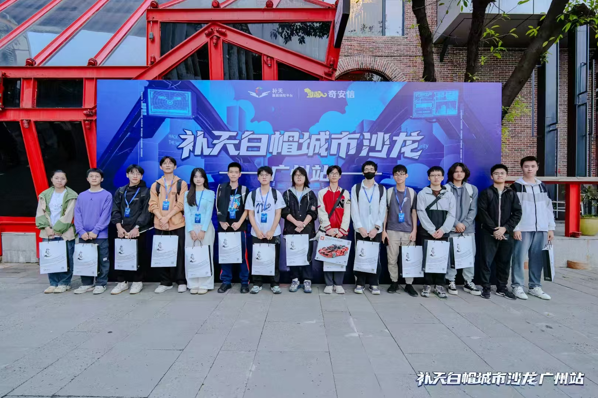
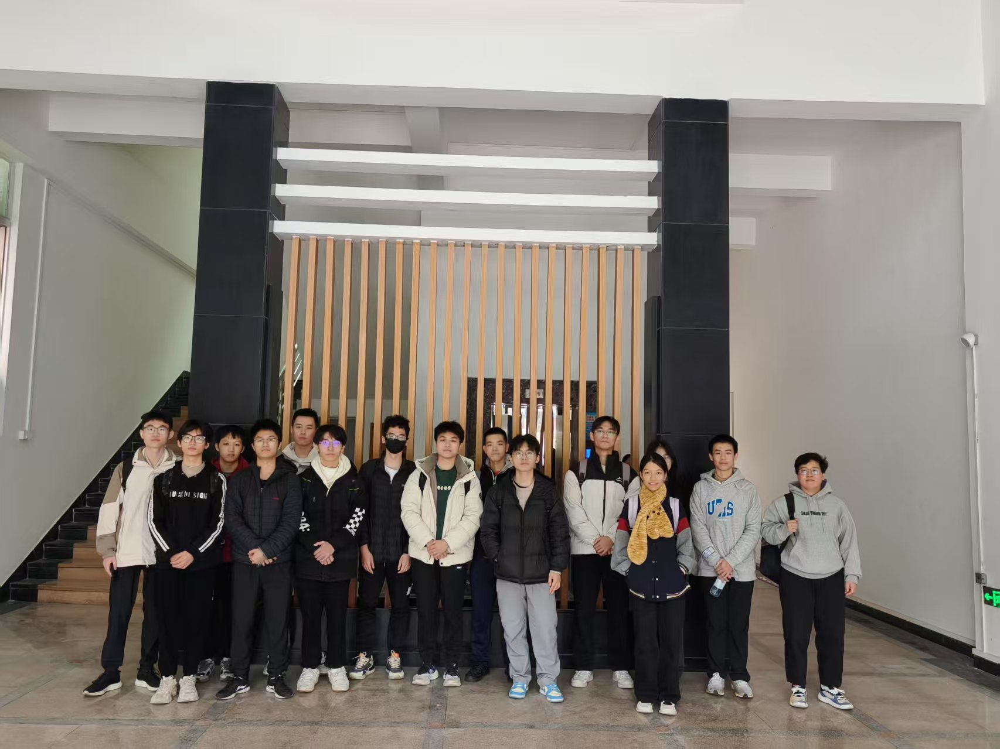

# HackTB网络安全实验室

HackTB网络安全实验室隶属于东莞理工学院网络安全学院，是一个专注于网络安全技术研究与实践的学术团体。本实验室秉承开放、自由、创新的理念，致力于为网络安全爱好者提供技术交流与实践平台。

## 研究方向与技术领域

本实验室涵盖以下主要研究方向：

| 研究方向       | 当前开展情况       |
| -------------- | ------------------ |
| 漏洞挖掘与分析 | ✅                  |
| 渗透测试技术   | ✅                  |
| 信息安全竞赛   | ✅                  |
| 安全软件开发   | ✅                  |
| 技术交流       | ✅                  |
| 跨领域创新     | ✅                  |
| 搞二次元       | ✅ 欸这是可以说的吗 |

我们欢迎所有对网络安全技术感兴趣的同学加入！

## 实验室特色

1. **自由创新的研究氛围**：鼓励成员自主选择研究方向，开展创新性安全研究
2. **实践导向的培养模式**：通过实际项目开发和安全竞赛提升技术能力
3. **多元化的技术交流**：定期组织技术分享会和安全研讨会
4. **产学研结合**：与行业企业合作开展安全项目实践

## 实验室守则

为确保实验室良好运行，所有成员需遵守以下规范：

::: danger
第 -1 条：
坚决不对dgut内部系统进行任何安全测试。

每一条莫名其妙的规定后面都是血的教训
:::

1. 提倡提出有深度的问题，并积极参与技术讨论
2. 定期分享有价值的技术资料、工具和研究成果
3. 主要研究方向为漏洞挖掘和渗透测试，同时欢迎其他安全技术交流
4. 建立知识共享机制，主动提问和回答他人问题
5. 保持适度的参与度，长期不活跃者将调整出实验室

## 实验室图片

## 实验室博客集合
::: tip
后面注册博客都用cnBlog吧, 都加到一个群里面, 方便大家获取信息流

https://edu.cnblogs.com/campus/dglgxy/HackApwn/join?id=CfDJ8KL9kPW-LSFBi_9YdTzcC09LbKVFugpiWTBcJPPYo6Lqs8B4NIdlrw5zriOc7WnwYCfFzesJWtlQJQkcLhVHuXuop08fbuyYK8RiWbRcVYj193tz_esr_7UJaUf7UyOvFH1yCWm4neEKeeK-1dM29yI
:::

## 加入方式

HackTB实验室实行全年开放申请制度。

### 申请条件：

**网络安全/计算机相关专业学生**：
需在[DGUT::CTF平台](https://www.hacktb.com:6001)完成至少一道CTF题目

**其他专业学生**：
- 平面设计与UI开发能力
- 技术文档编写能力
- 新媒体运营能力

来点美术佬、运维佬、开发佬吧，我们真的很缺这个

即便你暂时没有上述能力，也欢迎任何对网络安全感兴趣的同学加入我们。

### 申请流程：

1. 完成CTF题目挑战（相关专业申请者）
2. 准备申请材料，邮件标题格式：
   `[实验室申请]年级+专业+姓名`
3. 发送申请至以下任一联系人（请勿重复投递）：
   - 实验室指导老师：林老师（lynnzixing@dgut.edu.cn）
   - 平台技术负责人：归海言诺（tgychine@foxmail.com）
---

**补充联系方式**（仅作备用）：
- 电报群组：https://t.me/+sPTSzS2Y1bw5ZmI9
- 微信咨询：18620877503（请备注"实验室咨询"）

期待与您共同探索网络安全技术的无限可能！

## 博客推荐
[推荐大家使用cnBlog](https://edu.cnblogs.com/campus/dglgxy/HackApwn/join?id=CfDJ8KL9kPW-LSFBi_9YdTzcC09LbKVFugpiWTBcJPPYo6Lqs8B4NIdlrw5zriOc7WnwYCfFzesJWtlQJQkcLhVHuXuop08fbuyYK8RiWbRcVYj193tz_esr_7UJaUf7UyOvFH1yCWm4neEKeeK-1dM29yI)
后面注册博客都用吧, 都加到一个群里面, 方便大家获取信息流